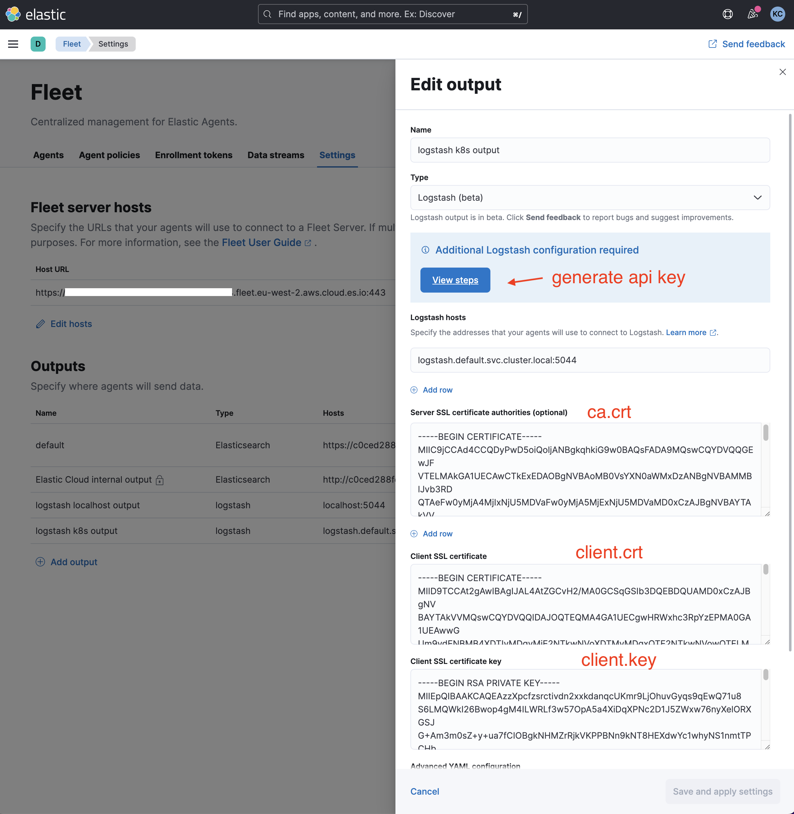
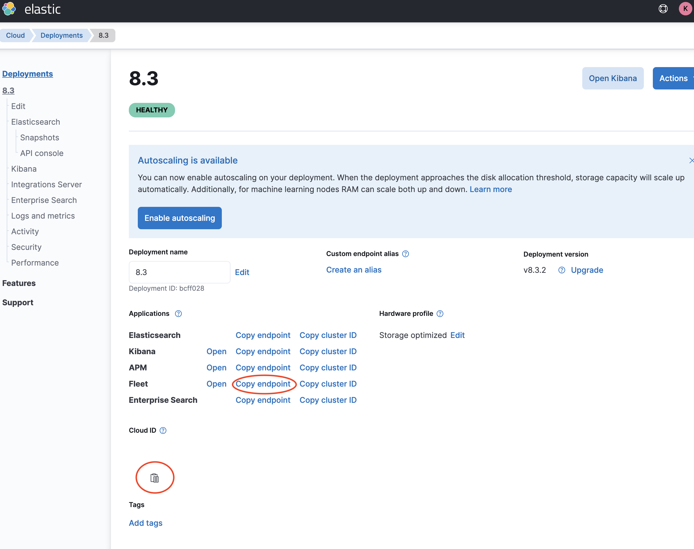
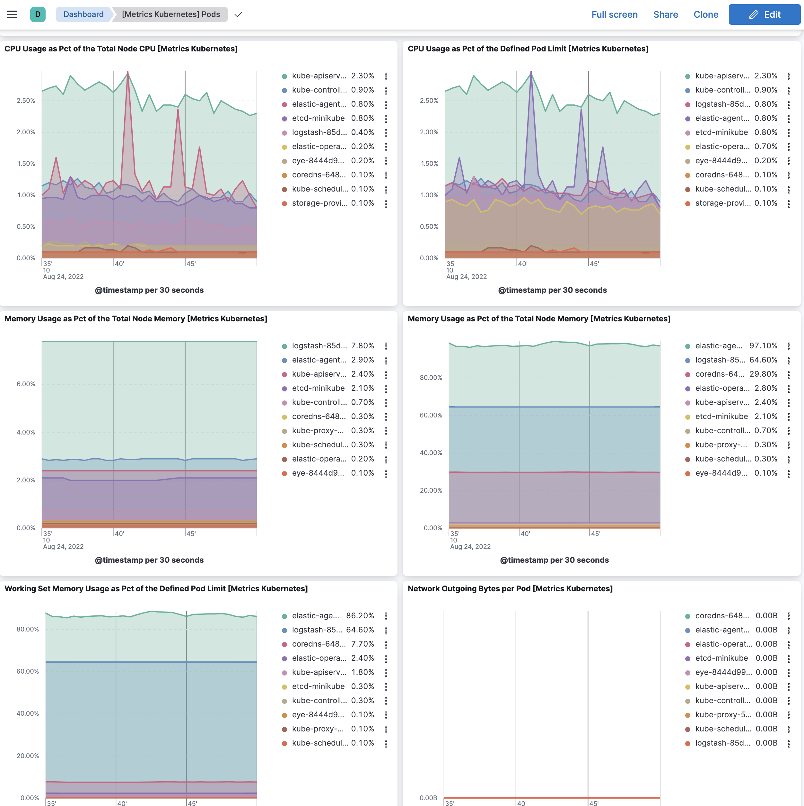

In this example, Elastic Agent enable kubernetes module and output to Logstash. Logstash send data to Cloud managed Elasticsearch.

For the moment, it includes
- Fleet managed Elastic Agent <> Logstash tls mutual verification
- Logstash <> Elasticsearch Cloud

## Deploy the example

Prepare cert/key for agent <> logstash. Agent is deployed to `kube-system` namespace. The DNS in certificate has pointed to `logstash.default.svc.cluster.local`. 

```
./cert/generate_cert.sh
```

Config logstash output(beta) in fleet
1. Go to Management > Fleet > Settings
2. Add output
   1. Generate api_key for logstash config. Copy api_key to `YOUR_API_KEY` in `001-configmap.yaml`
   2. Set hosts `logstash.default.svc.cluster.local:5044`
   3. Copy the content of ca.crt to Server SSL certificate
   4. Copy the content of client.crt to Client SSL certificate
   5. Copy the content of client.key to Client SSL certificate key
3. Create agent policy. Go to Fleet > Agent policies 
   1. In advance options, set Output for integrations and Output for agent monitoring to logstash output you created earlier.
4. Edit policy. Add integration. Add Kubernetes.
5. Get enrollment token. Go to Fleet > Enrollment tokens 
   1. Copy token to `YOUR_ENROLLMENT_TOKEN` in `004-elastic-agent-managed-kubernetes.yaml`

Config endpoint 
1. Go to cloud deployment 
2. Copy Fleet endpoint to `YOUR_FLEET_URL` in `004-elastic-agent-managed-kubernetes.yaml`
3. Copy Cloud ID to `YOUR_CLOUD_ID` in `001-configmap.yaml`

Deploy the example
```
kubectl apply -f .
```

Check deployment
1. Data should show in Dashboard. Go to Analytics > Dashboard > [Metrics Kubernetes] Pods 

## Clean up the example
```
kubectl delete daemonset.apps/elastic-agent rolebinding.rbac.authorization.k8s.io/elastic-agent rolebinding.rbac.authorization.k8s.io/elastic-agent-kubeadm-config role.rbac.authorization.k8s.io/elastic-agent role.rbac.authorization.k8s.io/elastic-agent-kubeadm-config serviceaccount/elastic-agent -n kube-system
kubectl delete service,pods,deployment,configmap,secret -l app=logstash-agent-demo
```
